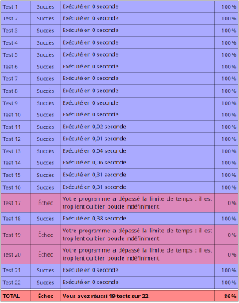
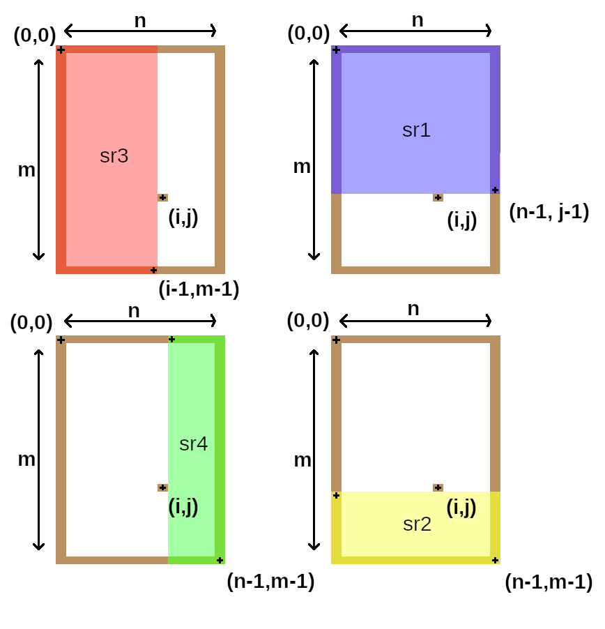
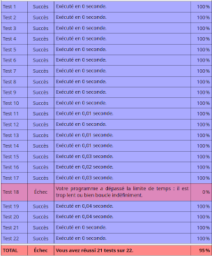
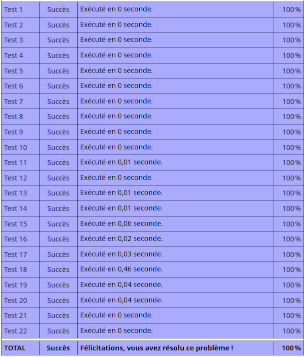
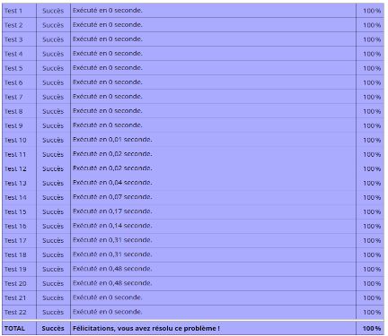

# Plusieurs solutions, la dernière est complète

## Solution naïve (passe presque tous les tests)
L'idée est de parcourir tous les carrés possibles dans la parcelle totale représentant le camping.   
Ainsi pour chaque zone formée d'un point p_ij du carré l'on essaie d'étendre tant qu'on cette zone en bas et à droite.  

L'optimisation de cette solution naïve consiste en deux choses : 
    * L'on retient les points du carrés sur la diagonale bas-droite partant du point p_ij étant dans un carré libre et l'on ne traite pas ces points.  
    * soit c la taille maximale du meilleur carré trouvé jusqu'ici et un point p_ij du camping, l'on regarde d'abord si l'aggrandissement de un du carré délimité par ``(p_ij, (fst p_ij+c, snd p_ij+c))`` est possible (pas de débordement et toutes les zones sont libres) puis éventuellement nous vérifions le carré en entier.
<p align="center"> </p>

## Solution "géométrique"
Une seconde approche du problème est construite sur une observation géométrique :   
Soit `sr` un sous-rectangle du camping et un point p de coordonnée (i, j) comportant trop de moustiques (dit "point de coupure").  
Alors la taille maximale d'un carré de sr est égale à la taille maximale parmis les quatres sous-rectangles suivants, notés sr1, ..., sr4 :  

<p align="center"> </p>

De plus, chacun de ces sous-rectangles contient strictement moins de points de coupures.
Ainsi, par récurrence, nous pouvons obtenir les carrés sans points de coupures.

<p align="center"> </p>

Une erreure survient pour le `test 18`. J'avance que nous ne sommes pas loin de la complexité attendue et qu'une différence de parcours des possibilités permet d'obtenir la solution attendue dans le temps imparti.
En fait avec l'actuelle implémentation l'agorithme trouve bien une solution optimale à temps, mais "continue à boucler un peu trop".__
On peut "réparer" cela avec un bricolage, ce qui a été fait ici : on sort de la boucle while si l'on estime qu'on a déjà "trop bouclé". Ça passe les tests mais peu satisfaisant.
On pourrait par exemple chercher à majorer la solution optimale, et s'arrêter une fois atteinte.

<p align="center"> </p>

## Solution par programmation dynamique

Voici l'équation de récurrence :

```
Soit (x,y) les coordonnées d'un point du tableau t, on note pgcl (pour Plus Grand Carré Libre) la fonction de récurrence (mémoïsée).

    pgcl(n,_) = 0  
    pgcl(_,m) = 0  
    pgcl(x,y) = 1 + min (pgcl(x+1,y), pgcl(x,y+1), pgcl(x+1,y+1)) si t.(x).(y) == False  
                0 sinon  
```

Elle permet de construire un tableau qui à chaque case (x,y) associe la taille maximale des carrées ayant cette case pour coin haut-gauche.
Il suffit ensuite de parcourir les cases du tableau pour trouver celle qui associe à la valeur maximale.  

On obtient une complexité de `O(n*m)`

<p align="center"> </p>
